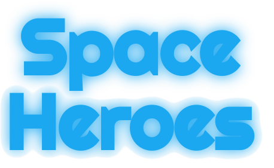

### Overview

Space Heroes is a modern, modular, in-browser rendition of the Atari classic Space Invaders.

This game is an experiment in the power and convenience of the new JavaScript ES6 module and class syntax. The new syntax allows truly object-oriented organization of the game's code. The new class syntax allows for the easy breakdown of all in-game objects, including projectiles, enemies, and even particles, into logical hierarchies. This makes creating new content, such as new missiles, enemies, and levels, much faster while keeping the code DRY.

The game's graphics were created with the Canvas API. Thanks to the above mentioned class breakdown, the motion of all movable objects is animated according to their position and velocity properties.

### Rules

Aliens are invading Earth. You are the commander of the vanguard ship of the newly formed US Space Force and it is up to you to hold of the invading hordes while Earth readies itself for the invasion.

Earn points by hitting and shooting down UFOs. Lose point by being hit and wasting ammunition - that's US taxpayer money you are shooting into the void of space.

Hold off the aliens as long as you can and be remembered forever in the Hall of Heroes once you have made the final sacrifice.

## Code Highlights

### ES6 Modules and Classes

The ES6 module import/export syntax enables creation of fully functional game objects with surprisingly little code, and that without the use of external libraries. The code below creates an enemy object that is rendered on screen. It can be rendered on the screen, move in an assigned pattern, has full collision, and custom shooting behavior. However all of these functions are compartmentalized in separate classes and kept neatly away in separate files. A new variation of an enemy like this can thus be created in a few minutes, with all default functionality added with a single import statement and class extension designation.

```javascript
import Enemy from './enemy.js';
import { game } from '../main.js';


class ClassicGrunt extends Enemy {
  constructor(props) {
    super(props);
  }

  getVx() {
    if (this.x + this.width >= this.xBounds.max || this.x <= this.xBounds.min) {
      if (this.yBounds.max < 680) {
        this.yBounds.max = this.yBounds.max + 25;
      } else if(this.yBounds.max >= 680 || this.y >= 700 - this.height) {
        this.yBounds.max = 720;
        game.gameOver();
      }
      this.vx *= -1;
    }

    return this.vx;
  }

  translate() {
    this.getVx();
    super.translate();
  }
}

export default ClassicGrunt;
```

### Canvas

The canvas API allows the rendering of graphics which would take much more time to generate in regular JavaScript. Even particle effects can be easily simulated with randomly generated Canvas polygons laid over a background image. The code below generates explosive particle effects for any object passed into the constructor class. This makes it possible to create custom explosive effects for any object generated with any image. Although lengthy at first glance, the vast majority of the code in this class either extract information from the object for which the particles are being generated or doing simple arithmetic on those extracted objects.

```javascript
// scripts/classes/fragment_particle.js

import Movable from './movable.js';
import { game } from '../main.js';

class Fragment extends Movable {
  constructor(object) {
    super({});
    this.image = object.image;
    this.centerX = object.x + object.width / 2;
    this.centerY = object.y + object.height / 2;
    this.minX = object.x;
    this.minY = object.y;
    this.width = object.width;
    this.height = object.height;
    this.vertex1 = [
      this.minX + this.width * Math.random(),
      this.minY + this.height * Math.random()
    ];
    this.vertex2 = [
      this.minX + this.width * Math.random(),
      this.minY + this.height * Math.random()
    ];
    this.vx = (7 + Math.random() * 7) * (Math.random() < 0.5 ? -1 : 1);
    this.vy = (7 + Math.random() * 7) * (Math.random() < 0.5 ? -1 : 1);

    this.ref = Math.random();
    game.drawObject(this);
  }

  translate() {
    this.centerX += this.vx;
    this.centerY += this.vy;
    this.vertex1[0] += this.vx;
    this.vertex1[1] += this.vy;
    this.vertex2[0] += this.vx;
    this.vertex2[1] += this.vy;

    if (
      this.centerX < 0 ||
      this.centerX > 1250 ||
      this.centerY < 0 ||
      this.centerY > 720
    ) {
      game.eraseObject(this);
    }
  }

  draw(context) {
    var pattern = context.createPattern(this.image, "repeat");
    context.fillStyle = pattern;

    context.beginPath();
    context.moveTo(this.centerX, this.centerY);
    context.lineTo(this.vertex1[0], this.vertex1[1]);
    context.lineTo(this.vertex2[0], this.vertex2[1]);
    context.closePath();
    context.fill();
    this.translate();
  }
}

export default Fragment;
```

One challenge to overcome when using Canvas is its inability to render GIF files. Because the canvas is re-rendered many times a second, the frames of a GIF would never be allowed to change as it would be re-rendered by Canvas at the first frame before it got the change to move it the second one.
In order to add explosion graphics to the game, this limitation was overcome by breaking the GIF down into separate images, adding an interval to simulate the GIF's normal frame timing, and iterating over the different images on the created interval.

```javascript
// scripts/classes/explosion.js

import Drawable from './drawable.js';
import { game } from '../main.js';

class Explosion extends Drawable {
  constructor(object) {
    ...
  }

  moveFrame() {
    if (this.frameIdx >= 5) {
      game.eraseObject(this);
    } else {
      const image = new Image();
      image.src = `assets/theme_1/explosion/${this.frameIdx}.png`;
      this.setImage(image);
      this.frameIdx++;
    }
  }

  draw(context) {
    if (!this.timerID) {
      this.moveFrame();
      this.timerID = setInterval(this.moveFrame.bind(this), 100);
    }
    super.draw(context);
  }
}

export default Explosion;
```

Another challenge was not overloading the browser with too many canvas objects. Given that every missile and particle in the game is an object that must be rendered on the canvas every 20ms, and both get created in especially great numbers, the game would slow down noticeably if they were simply ignored when they moved off-screen. To prevent this kind of canvas overload, all objects that have the tendency to move off-screen are deleted from the list of render objects when they are no longer visible, keeping the number of objects to render at any given time manageable. This was easily accomplished by adding an extra condition to the inherited translate function.

```javascript
// sctipts/classes/missle.js

...
translate() {
  super.translate();
  if (this.y < 0 - this.height || this.y > 720) {
    this.delete();
  }
}
...
```
